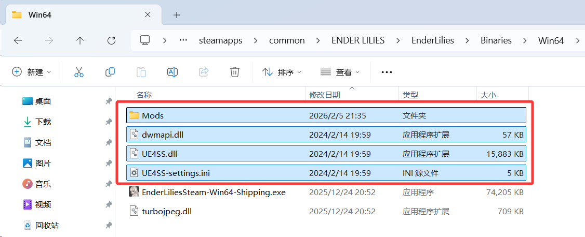
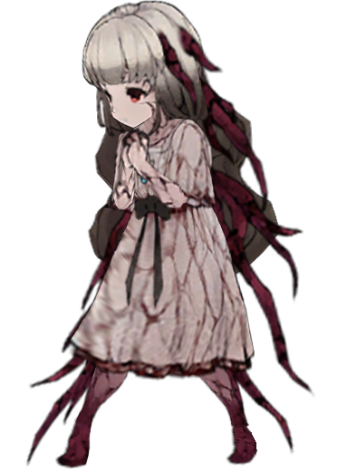
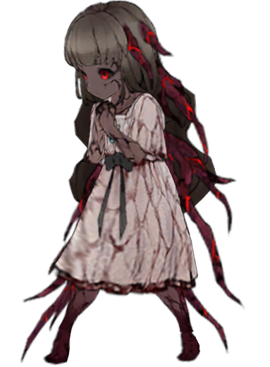
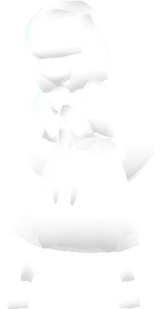
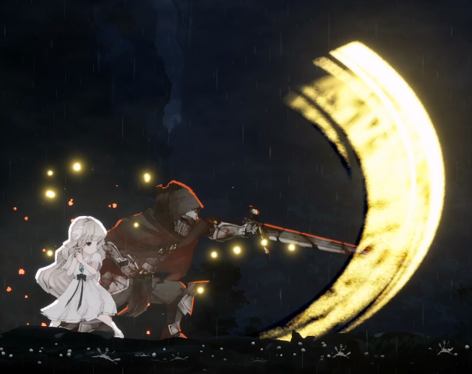
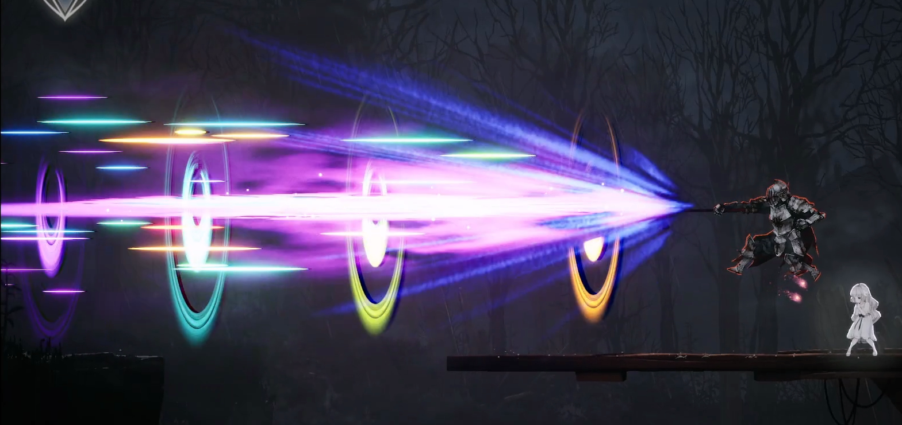
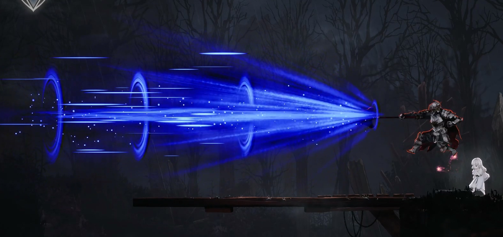
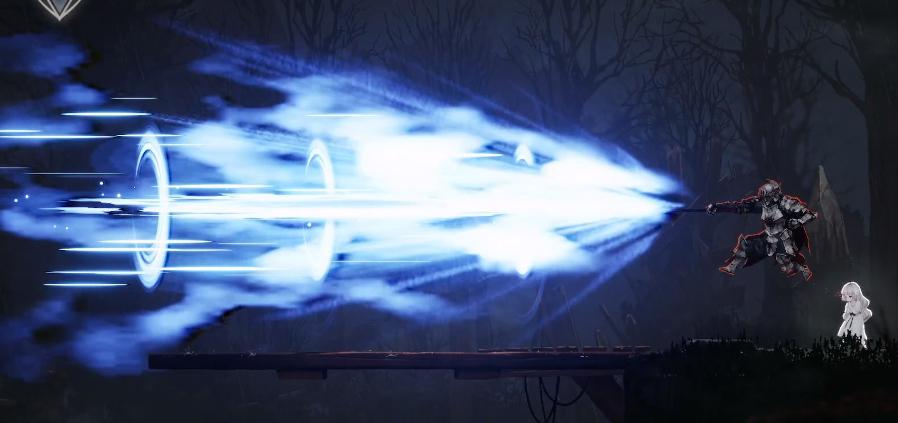

[**English**](README.md) | **简体中文**

# 《终焉之莉莉》“更多皮肤” 模组

本模组为《终焉之莉莉：骑士寂夜》提供了强大的皮肤切换系统。它不仅包含多套预设皮肤，还支持创作者通过配套的 SDK 快速开发并导入自定义 Spine 皮肤。

---

## 🎮 游戏内效果预览

---

## ⬇️ 下载与安装

### 1. 获取资源
前往 [Releases](https://github.com/f14XuanLv/EnderLilies-More-Skins/releases) 页面下载以下两个压缩包：
*   `UE4SS_For_More_Skins_Mod.zip` (核心注入工具)
*   `LogicMods.zip` (模组逻辑资产)

### 2. 安装步骤
1.  **安装 UE4SS**：
    *   解压 `UE4SS_For_More_Skins_Mod.zip`。
    *   将解压出的所有文件（`Mods/`, `dwmapi.dll`, `UE4SS-settings.ini` 等）放入游戏的运行目录：
        `ENDER LILIES/EnderLilies/Binaries/Win64/`
    *   效果如下图：
    *   
2.  **安装逻辑资产**：
    *   在游戏内容目录 `ENDER LILIES/EnderLilies/Content/Paks/` 下新建一个名为 `LogicMods` 的文件夹。
    *   解压 `LogicMods.zip`，将得到的 `.pak`, `.ucas`, `.utoc` 文件全部放入该 `LogicMods` 文件夹中。
    *   效果如下图：
    *   

---

## 🎭 皮肤预览与操作 (Skin Preview & Controls)

安装模组后，你可以在游戏内随时通过 **`Alt + 数字/字母键`** 实时切换皮肤。
> [!IMPORTANT]
> **变体循环切换**：若某个编号包含多个样式（变体），**连续按下相同的快捷键**即可在该组变体中循环切换（例如：按 `Alt+1` 切换基础款，再次按 `Alt+1` 切换变体）。

### 1. 原版阶段皮肤 (Blighted Stages)
这些皮肤基于莉莉在游戏剧情中的秽鬼化进程。

| 编号 | 快捷键 | 基础预览 (Base) | 附加变体 (Variants) |
| :--- | :--- | :---: | :--- |
| **p0001** | `Alt + 1` |  |   |
| **p0002** | `Alt + 2` |  | `-` |
| **p0003** | `Alt + 3` |  | `-` |
| **p0004** | `Alt + 4` |  | `-` |
| **p0005** | `Alt + 5` |  | `-` |
| **p0006** | `Alt + 6` |  | `-` |

### 2. 独立自定义皮肤 (Advanced Skins)
通过 SDK 制作的具有独立骨骼和动画能力的扩展皮肤。

| 编号 | 快捷键 | 基础预览 (Base) | 附加变体 (Variants) |
| :--- | :--- | :---: | :--- |
| **p0007** | `Alt + 7` |  |   |
| **p0008~**| `Alt + 8~` | (待扩展) | `-` |

### 3. 特殊模式 (Special Mode)

| 功能 | 快捷键 | 基础预览 | 效果描述 |
| :--- | :--- | :--- | :--- |
| **幽灵模式** | `Alt + 0` |  | 莉莉将进入纯白状态， 按下 Alt + 其他已注册数字键 可恢复。 |

---

## 角色技能修改（额外内容）

### 黑色骑士（快捷键 Alt + X）

#### 平A

**艾尔登法环 · 黄金律法风格 · 神圣属性附魔**

 

---

### 骑士长尤利乌斯（快捷键 Alt + Z 轮换）

#### 奥义

**东方Project · 魔理沙 · 恋符「Master Spark」**

---

**艾尔登法环 · 黑夜魔法风格 · 黑夜彗星亚兹勒**

---

**镭射炮 · 苍蓝色调**

---

## 🛠️ 模组开发 (SDK & Development)

如果您是创作者，希望制作并发布属于自己的莉莉皮肤，请参阅以下全套开发套件与指引：

### 开发文档
*   [**快速上手指南 (环境搭建与构建)**](docs/GETTING_STARTED.zh-CN.md) — 包含从零搭建 UE 4.26.2 开发环境、获取项目代码，到运行自动化脚本构建模组的全流程验证指南。
*   [**皮肤制作与接入规范**](docs/SKIN_CREATION.zh-CN.md) — 讲解模组支持的两类皮肤（简单皮肤 / 高级皮肤）的概念、文件命名规范、目录结构要求，以及如何将其注入游戏引擎。
*   [**源码修改与对齐说明**](docs/DEVELOPMENT_NOTES.zh-CN.md) — **【进阶】** 深入了解本 SDK 如何通过修改 Spine Runtime 源码，实现与原版游戏资产结构及逻辑的“像素级”对齐。

### 在线工具
> [!TIP]
> **[Ender Lilies More Skins Modding Toolkit](https://f14xuanlv.github.io/EnderLilies-More-Skins-Modding-Toolkit/)**
> 这是一个纯前端的在线工具，支持像素级还原打包纹理、一键生成高级皮肤骨骼模板及自动对齐 ID 引用。

---

## 🔮 核心潜力与技术上限 (Core Potential & Technical Ceiling)

本项目的意义不仅在于“换装”，它建立了一套完整的 Spine 资产重构工作流。通过深入理解本项目的 SDK 与对齐逻辑，你可以触达以下技术上限：

### 1. 项目工作流的上限：深度重构与完全转换
本模组的构建工作流支持对莉莉进行**像素级以外的结构性修改**：
*   **外挂部件与装饰**：你可以为莉莉添加原本不存在的骨骼与挂件（例如：会动的猫耳、随风飘动的披风或全覆盖的长裙）。
*   **动作特效增强**：你可以通过修改 Spine 骨骼逻辑，为特定动作注入全新的视觉特效。例如，将《空洞骑士》主角小骑士的二段跳 **“帝王之翼”** 特效完全移植给莉莉，或为闪避动作添加残影骨骼。
*   **角色完全替代 (Total Conversion)**：只要保持动画状态（Animation State）的命名规范与逻辑结构不变，你可以将莉莉**彻底替换为另一个角色**（如替换为《血源诅咒》的玛丽亚或完全原创的角色），并保留原版所有流畅的战斗反馈。

### 2. 底层原理的上限：全游戏主题重塑
本项目所采用的资产对齐与注入原理，理论上适用于游戏内**任何基于 Spine 驱动的对象**：
*   **全对象覆盖**：通过参考本项目的逻辑，你可以对游戏内的**普通敌人、Boss、NPC** 甚至具有物理动画的环境物件进行同样的修改与拓展。
*   **特定主题化改造**：由于可以统一修改所有 Spine 对象的骨骼与贴图，开发者有能力发起“全游戏主题重绘计划”。例如，将所有 Boss 联动为特定的动漫角色，或将全游戏美术风格统一重塑为“赛博朋克”或“极简简笔画”风格。
*   **结论**：这套方案实际上提供了一个 **“游戏美术补丁包”** 的底层框架，其最终上限是将《终焉之莉莉》变成一个承载完全不同艺术表达的平台。

---

## 🤝 贡献与投稿

非常欢迎社区成员分享创作的皮肤！

1.  **提交作品**：如果您创作了优质的皮肤，可以通过以下任意方式进行投稿：
    *   **GitHub**: 提交 **Pull Request** 或开启一个新的 **Issue**。
    *   **Discord**: 直接私信联系作者，分享您的作品。
2.  **加入计划**：优秀的皮肤资产将会被整合进本模组的后续 Release 版本中，并注明作者信息。

#### 联系作者
如果您在开发过程中遇到技术难题，或有任何合作意向，可以通过以下方式联系我：

---

## 💖 鸣谢

*   [EnderLilies.DebugMod](https://github.com/Trexounay/EnderLilies.DebugMod)
*   [EnderLilies.DebugModExtended](https://github.com/EnderLiliesFans5040/EnderLilies.DebugModExtended)
*   [UE4SS](https://github.com/UE4SS-RE/RE-UE4SS)
*   [p0001_1_Lily 皮肤来源](https://github.com/DreamerArumia/Ender-Lilies-Reskin-Mod)